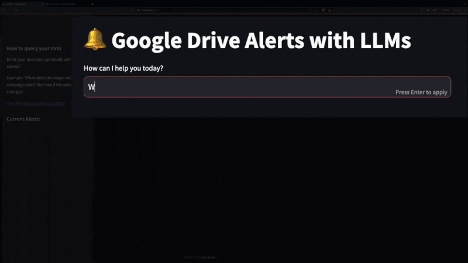

# LLM App

<!---  --->

Pathway's **LLM (Large Language Model) Apps** allow you to quickly put in production AI applications which offer **high-accuracy RAG at scale** using the most **up-to-date knowledge** available in your data sources.

The apps connect and sync (all new data additions, deletions, updates) with data sources on your **file system, Google Drive, Sharepoint, S3, Kafka, PostgreSQL, real-time data APIs**. They come with no infrastructure dependencies that would need a separate setup. They include **built-in data indexing** enabling vector search, hybrid search, and full-text search - all done in-memory, with cache.

## Application Templates

The application templates provided in this repo scale up to **millions of pages of documents**. Some of them are optimized for simplicity, some are optimized for amazing accuracy. Pick the one that suits you best. You can use it out of the box, or change some steps of the pipeline - for example, if you would like to add a new data source, or change a Vector Index into a Hybrid Index, it's just a one-line change. 

| Application (template)                                                                           | Description                                                                                                                                                                                                                                                                                                                                                         |
| --------------------------------------------------------------------------------- | ------------------------------------------------------------------------------------------------------------------------------------------------------------------------------------------------------------------------------------------------------------------------------------------------------------------------------------------------------------------- |
| [`Question-Answering RAG App`](examples/pipelines/demo-question-answering/)    | Basic end-to-end RAG app. A question-answering pipeline that uses the GPT model of choice to provide answers to queries to your documents (PDF, DOCX,...) on a live connected data source (files, Google Drive, Sharepoint,...). You can also try out a [demo REST endpoint](https://pathway.com/solutions/rag-pipelines#try-it-out).              |
| [`Live Document Indexing (Vector Store / Retriever)`](examples/pipelines/demo-document-indexing/)     | A real-time document indexing pipeline for RAG that acts as a vector store service. It performs live indexing on your documents (PDF, DOCX,...) from a connected data source (files, Google Drive, Sharepoint,...). It can be used with any frontend, or integrated as a retriever backend for a [Langchain](https://pathway.com/developers/templates/langchain-integration) or [Llamaindex](https://pathway.com/developers/templates/llamaindex-pathway) application. You can also try out a [demo REST endpoint](https://pathway.com/solutions/ai-contract-management#try-it-out).         |
| [`Multimodal RAG pipeline with GPT4o`](examples/pipelines/gpt_4o_multimodal_rag/) | Multimodal RAG using GPT-4o in the parsing stage to index PDFs and other documents from a connected data source files, Google Drive, Sharepoint,...). It is perfect for extracting information from unstructured financial documents in your folders (including charts and tables), updating results as documents change or new ones arrive.|
| [`Unstructured-to-SQL pipeline + SQL question-answering`](examples/pipelines/unstructured_to_sql_on_the_fly/) | A RAG example which connects to unstructured financial data sources (financial report PDFs), structures the data into SQL, and loads it into a PostgreSQL table. It also answers natural language user queries to these financial documents by translating them into SQL using an LLM and executing the query on the PostgreSQL table. |
| [`Alerting when answers change on Google Drive`](examples/pipelines/drive_alert/)                                        | Ask questions about your private data (docs), and tell the app to alert you whenever responses change. The app is always connected to your Google Docs folder and listening for changes. Whenever new relevant information is added to the data sources, the LLM decides if there is a substantial difference in response and notifies the user with a Slack message.|
| [`Adaptive RAG App`](examples/pipelines/adaptive-rag/) | A RAG application using Adaptive RAG, a technique developed by Pathway to reduce token cost in RAG up to 4x while maintaining accuracy. |
| [`Private RAG App with Mistral and Ollama`](examples/pipelines/private-rag/) |  A fully private (local) version of the `demo-question-answering` RAG pipeline using Pathway, Mistral, and Ollama. |

## How do these LLM Apps work?

The apps can be run as **Docker containers**, and expose an **HTTP API** to connect the frontend. To allow quick testing and demos, some app templates also include an optional Streamlit UI which connects to this API. 

The apps rely on the [Pathway framework](https://github.com/pathwaycom/pathway) for data source synchronization and for serving API requests (Pathway is a standalone Python library with a Rust engine built into it). They bring you a **simple and unified application logic** for back-end, embedding, retrieval, LLM tech stack. There is no need to integrate and maintain separate modules for your Gen AI app: ~Vector Database (e.g. Pinecone/Weaviate/Qdrant) + Cache (e.g. Redis) + API Framework (e.g. Fast API)~. Pathway's default choice of **built-in vector index** is based on the lightning-fast [Tantivy](https://github.com/quickwit-oss/tantivy) library, and works out of the box.

## Getting started

Each of the [App templates](examples/pipelines/) in this repo contains a README.md with instructions on how to run it.

You can also find [more ready-to-run code templates](https://pathway.com/developers/templates/) on the Pathway website.

## Some visual highlights

Effortlessly extract and organize table and charts data from PDFs, docs, and more with multimodal RAG - in real-time:

(Check out [`Multimodal RAG pipeline with GPT4o`](examples/pipelines/gpt_4o_multimodal_rag/) to see the whole pipeline in the works. You may also check out the [`Unstructured-to-SQL pipeline`](examples/pipelines/unstructured_to_sql_on_the_fly/) for a minimal example which works with non-multimodal models as well.)

Automated real-time knowledge mining and alerting:

(Check out the [`Alerting when answers change on Google Drive`](#examples) app example.)

###  Do-it-Yourself Videos

▶️ [An introduction to building LLM apps with Pathway](https://www.youtube.com/watch?v=kcrJSk00duw) - by [Jan Chorowski](https://scholar.google.com/citations?user=Yc94070AAAAJ)

▶️ [Let's build a real-world LLM app in 11 minutes](https://www.youtube.com/watch?v=k1XGo7ts4tI) - by [Pau Labarta Bajo](https://substack.com/@paulabartabajo)

## Troubleshooting

To provide feedback or report a bug, please [raise an issue on our issue tracker](https://github.com/pathwaycom/pathway/issues).

## Contributing

Anyone who wishes to contribute to this project, whether documentation, features, bug fixes, code cleanup, testing, or code reviews, is very much encouraged to do so. If this is your first contribution to a Github project, here is a [Get Started Guide](https://docs.github.com/en/get-started/quickstart/contributing-to-projects). 

If you'd like to make a contribution that needs some more work, just raise your hand on the [Pathway Discord server](https://discord.com/invite/pathway) (#get-help) and let us know what you are planning!

## Supported and maintained by

  

  

