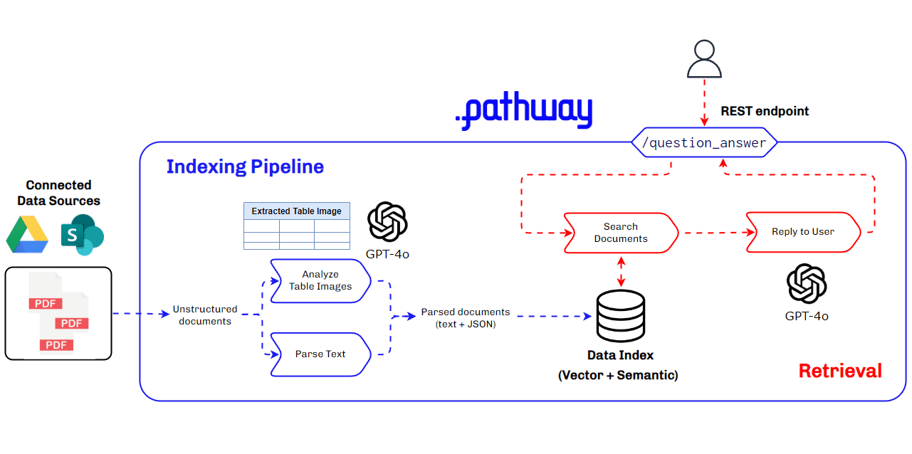

<p align="center" class="flex items-center gap-1 justify-center flex-wrap">
    
    <a href="https://pathway.com/developers/user-guide/deployment/gcp-deploy">Deploy with GCP</a> |
    
    <a href="https://pathway.com/developers/user-guide/deployment/aws-fargate-deploy">Deploy with AWS</a> |
    
    <a href="https://pathway.com/developers/user-guide/deployment/azure-aci-deploy">Deploy with Azure</a> |
    
    <a href="https://pathway.com/developers/user-guide/deployment/render-deploy"> Deploy with Render </a>
</p>

# Multimodal RAG with Pathway: Process your Financial Reports and Tables with GPT-4o

## **Overview**

This app template showcases how you can build a multimodal RAG application and launch a document processing pipeline that utilizes a vision language model like the `GPT-4o` for parsing. Pathway processes unstructured financial documents within specified directories, extracting and storing the information in a scalable in-memory index. This index is optimized for dynamic RAG, ensuring that search results are continuously updated as documents are modified or new files are added.

Using this approach, you can make your AI application run in permanent connection with your drive, in sync with your documents which include visually formatted elements: tables, charts, images, etc. 

We specifically use `GPT-4o` to improve the table data extraction accuracy and demonstrate how this approach outperforms the industry-standard RAG toolkits.

In this showcase, we focused on the finance domain because financial documents often rely heavily on tables in various forms. This showcase highlights the limitations of traditional RAG setups, which struggle to answer questions based on table data. By contrast, our multimodal RAG approach excels in extracting accurate information from tables.

The following GIF shows a snippet from our experiments:


If you want to skip the explanations, you can directly find the code [here](#Running-the-app).

## Table of contents

This includes the technical details to the steps to create a REST Endpoint to run the dynamic RAG application via Docker and modify it for your use-cases.

- [Overview](#Overview)
- [Architecture](#Architecture)
- [Pipeline Organization](#Pipeline-Organization)
- [Customizing the pipeline](#Customizing-the-pipeline)
- [Running the app](#Running-the-app)
- [Conclusion](#Conclusion)


## Architecture

We use `GPT-4o` in two separate places in the flow of data:
- Extracting and understanding the tables inside the PDF
- Answering questions with the retrieved context



The architecture of this multimodal RAG application involves several key components:

- **Data Ingestion**: Ingests data from various sources like local folders, Google Drive, or SharePoint.
- **Document Parsing and Embedding**: Utilizes `DoclingParser` for parsing documents and `OpenAIEmbedder` for embedding text. This includes handling and processing images within PDFs.
- **Document Store**: The `DocumentStoreServer` indexes parsed documents and retrieves relevant chunks for answering questions.
- **Question Answering**: Uses the `BaseRAGQuestionAnswerer` class to call `GPT-4o` for generating responses based on the retrieved context.
- **Server Setup**: Sets up a REST endpoint to serve the RAG application.

For more advanced RAG options, make sure to check out [rerankers](https://pathway.com/developers/api-docs/pathway-xpacks-llm/rerankers) and the [adaptive rag example](../adaptive-rag/).


## Pipeline Organization

This folder contains several objects:
- `app.py`, the main application code using Pathway and written in Python. It reads configuration from `app.yaml`, and runs a server answering queries to the defined pipeline.
- `app.yaml`, YAML configuration file, that defines components of the pipeline.
- `Dockerfile`, the Docker configuration for running the pipeline in a container. It includes instructions for installing dependencies and setting up the runtime environment.
- `requirements.txt`, the dependencies for the pipeline. This file can be passed to `pip install -r requirements.txt` to install everything needed to launch the pipeline locally.
- `.env`, a short environment variables configuration file where the OpenAI key must be stored. This file ensures secure handling of sensitive information.
- `data/`, a folder with exemplary files that can be used for test runs. It includes sample financial documents to demonstrate the pipeline's capabilities.

## Customizing the pipeline

The code can be modified by changing the `app.yaml` configuration file. To read more about YAML files used in Pathway templates, read [our guide](https://pathway.com/developers/user-guide/llm-xpack/yaml-templates).

In the `app.yaml` file we define:
- input connectors
- LLM
- embedder
- index
and any of these can be replaced or, if no longer needed, removed. For components that can be used check 
Pathway [LLM xpack](https://pathway.com/developers/user-guide/llm-xpack/overview), or you can implement your own.
 
You can also check our other templates - [demo-question-answering](https://github.com/pathwaycom/llm-app/tree/main/examples/pipelines/demo-question-answering), 
[Multimodal RAG](https://github.com/pathwaycom/llm-app/tree/main/examples/pipelines/gpt_4o_multimodal_rag) or 
[Private RAG](https://github.com/pathwaycom/llm-app/tree/main/examples/pipelines/private-rag). As all of these only differ 
in the YAML configuration file, you can also use them as an inspiration for your custom pipeline.

Here some examples of what can be modified.

### LLM Model

This template by default uses two llm models - GPT-3.5 Turbo for answering queries and GPT-4o for parsing tables and images.

You can replace GPT-3.5 Turbo with other Open AI models, like GPT-4, or GPT-4 Turbo.
You can find the whole list on their [models page](https://platform.openai.com/docs/models/gpt-4-and-gpt-4-turbo).

You simply need to change the `model` to the one you want to use:
```yaml
$llm: !pw.xpacks.llm.llms.OpenAIChat
  model: "gpt-3.5-turbo"
  retry_strategy: !pw.udfs.ExponentialBackoffRetryStrategy
    max_retries: 6
  cache_strategy: !pw.udfs.DiskCache
  temperature: 0.05
  capacity: 8
```

You can also use different provider, by using different class from [Pathway LLM xpack](https://pathway.com/developers/user-guide/llm-xpack/overview),
e.g. here is configuration for locally run Mistral model.

```yaml
$llm: !pw.xpacks.llm.llms.LiteLLMChat
  model: "ollama/mistral"
  retry_strategy: !pw.udfs.ExponentialBackoffRetryStrategy
    max_retries: 6
  cache_strategy: !pw.udfs.DiskCache
  temperature: 0
  top_p: 1
  api_base: "http://localhost:11434"
```

You can also change LLM used for parsing in the same way, by changing `!parsing_llm` in `app.yaml`, just keep in mind to use a multimodal model.

### Webserver

You can configure the host and the port of the webserver.
Here is the default configuration:
```yaml
host: "0.0.0.0"
port: 8000
```

### Cache

You can configure whether you want to enable cache, to avoid repeated API accesses, and where the cache is stored.
Default values:
```yaml
with_cache: True
cache_backend: !pw.persistence.Backend.filesystem
  path: ".Cache"
```

### Data sources

You can configure the data sources by changing `$sources` in `app.yaml`.
You can add as many data sources as you want. You can have several sources of the same kind, for instance, several local sources from different folders.
The sections below describe how to configure local, Google Drive and Sharepoint source, but you can use any input [connector](https://pathway.com/developers/user-guide/connecting-to-data/connectors) from Pathway package.

By default, the app uses a local data source to read documents from the `data` folder.


## Running the app

> Note: Recommended way of running the Pathway on Windows is Docker, refer to [Running with the Docker section](#with-docker).

First, make sure to install the requirements by running:

```bash
pip install -r requirements.txt -U
```
Then, create a `.env` file in this directory and put your API key with `OPENAI_API_KEY=sk-...`, or add the `api_key` argument to `OpenAIChat` and `OpenAIEmbedder`. 

Then, simply run with `python app.py` in this directory.

### With Docker

First, make sure to have your OpenAI API key in the environment, you can create a `.env` file as mentioned above, or specify the `api_key` argument in the `OpenAIChat` and `OpenAIEmbedder`. 

In order to let the pipeline get updated with each change in local files, you need to mount the `data` folder inside the docker. The following commands show how to do that.

The following commands will:
- mount the `data` folder inside the Docker
- build the image
- run the app and expose the port `8000`.

You can omit the ```-v `pwd`/data:/app/data``` part if you are not using local files as a data source. 

```bash
# Make sure you are in the right directory.
cd examples/pipelines/gpt_4o_multimodal_rag/

# Build the image in this folder
docker build -t rag .

# Run the image, mount the `data` folder into image and expose the port `8000`
docker run -v `pwd`/data:/app/data -p 8000:8000 rag
```


## Querying the pipeline

Follow the [steps below](#running-the-app) to set up the service. This will create a REST endpoint on your selected host and port, running a service that is connected to your file folder, and ready to answer your questions. There are no extra dependencies.

In this demo, we run the service on localhost (`0.0.0.0:8000`). You can connect your own front end or application to this endpoint. Here, we test the service with `curl`.

First, let's check the files contained in your folder are currently indexed:
```bash
curl -X 'POST'   'http://0.0.0.0:8000/v2/list_documents'   -H 'accept: */*'   -H 'Content-Type: application/json'
```

This will return the list of files e.g. if you start with the [data folder](./data) provided in the demo, the answer will be as follows:
> `[{"modified_at": 1715765613, "owner": "berke", "path": "data/20230203_alphabet_10K.pdf", "seen_at": 1715768762}]`

In the default app setup, the connected folder is a local file folder. You can add more folders and file sources, such as [Google Drive](https://pathway.com/developers/user-guide/connectors/gdrive-connector#google-drive-connector) or [Sharepoint](https://pathway.com/developers/user-guide/connecting-to-data/connectors#tutorials), by adding a line of code to the template.

If you now add or remove files from your connected folder, you can repeat the request and see the index file list has been updated automatically. You can look into the logs of the service to see the progress of the indexing of new and modified files. PDF files of 100 pages should normally take under 10 seconds to sync, and the indexing parallelizes if multiple files are added at a single time.

Now, let's ask a question from one of the tables inside the report. In our tests, regular RAG applications struggled with the tables and couldn't answer to this question correctly.

```bash
curl -X 'POST'   'http://0.0.0.0:8000/v2/answer'   -H 'accept: */*'   -H 'Content-Type: application/json'   -d '{
  "prompt": "How much was Operating lease cost in 2021?" 
}'
```
> `{"response": "$2,699 million"}`

This response was correct thanks to the initial LLM parsing step. 
When we check the context that is sent to the LLM, we see that Pathway included the table in the context where as other RAG applications failed to include the table.


Let's try another one,

```bash
curl -X 'POST'   'http://0.0.0.0:8000/v2/answer'   -H 'accept: */*'   -H 'Content-Type: application/json'   -d '{
  "prompt": "What is the operating income for the fiscal year of 2022?" 
}'
```
> `{"response": "$74,842 million"}`

Another example, let's ask a question that can be answered from the table on the 48th page of the PDF.

```bash
curl -X 'POST'   'http://0.0.0.0:8000/v2/answer'   -H 'accept: */*'   -H 'Content-Type: application/json'   -d '{
  "prompt": "How much was Marketable securities worth in 2021 in the consolidated balance sheets?"                                              
}'
```
> `{"response": "$118,704 million"}`


Now, let's also fetch the context documents,
```bash
curl -X 'POST'   'http://0.0.0.0:8000/v2/answer'   -H 'accept: */*'   -H 'Content-Type: application/json'   -d '{
  "prompt": "How much was Operating lease cost in 2021?", "return_context_docs": true
}'
```
> `{"response": "$2,699 million", "context_docs": [{"text": "..."}, ...]`

Looking good!

## Conclusion

This showcase demonstrates setting up a powerful RAG pipeline with advanced table parsing capabilities, unlocking new finance use cases. While we've only scratched the surface, there's more to explore:

- Re-ranking: Prioritize the most relevant results for your specific query.
- Knowledge graphs: Leverage relationships between entities to improve understanding.
- Hybrid indexing: Combine different indexing strategies for optimal retrieval.
- Adaptive reranking: Iteratively enlarge the context for optimal accuracy, see [our example](../adaptive-rag/README.md).
Stay tuned for future examples exploring these advanced techniques with Pathway!

RAG applications are most effective when tailored to your specific use case. Here's how you can customize yours:

- Document parsers and splitters: Fine-tune how documents are processed and broken down for analysis.
- Indexing and retrieval strategies: Choose the most efficient approach for your data and search needs.
- User Interface (UI): Design a user-friendly interface that caters to your end users' workflows.

Ready to Get Started? 

Let's discuss how we can help you build a powerful, customized RAG application. [Reach us here to talk or request a demo!](https://pathway.com/solutions/slides-ai-search?modal=requestdemo)


## Quick Links:

- [Pathway Developer Documentation](https://pathway.com/developers/user-guide/introduction/welcome)
- [Pathway App Templates](https://pathway.com/developers/templates)
- [Discord Community of Pathway](https://discord.gg/pathway)
- [Pathway Issue Tracker](https://github.com/pathwaycom/pathway/issues)
- [End-to-end dynamic RAG pipeline with Pathway](https://github.com/pathwaycom/llm-app/tree/main/examples/pipelines/demo-question-answering)
- [Using Pathway as a retriever with LlamaIndex](https://docs.llamaindex.ai/en/stable/examples/retrievers/pathway_retriever/) 

Make sure to drop a "Star" to our repositories if you found this resource helpful!
